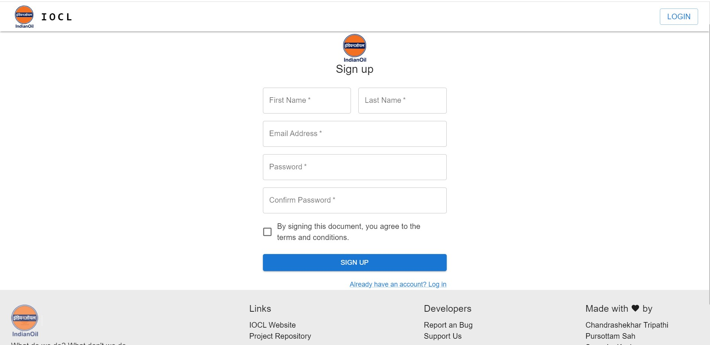
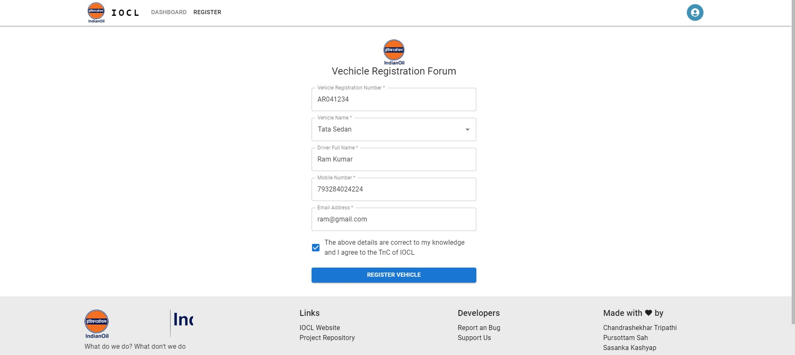
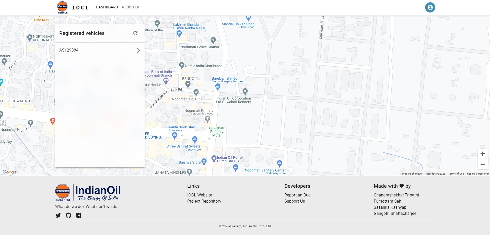
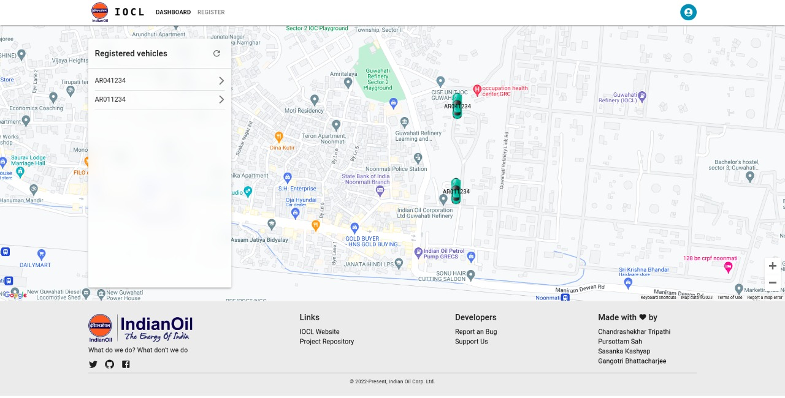
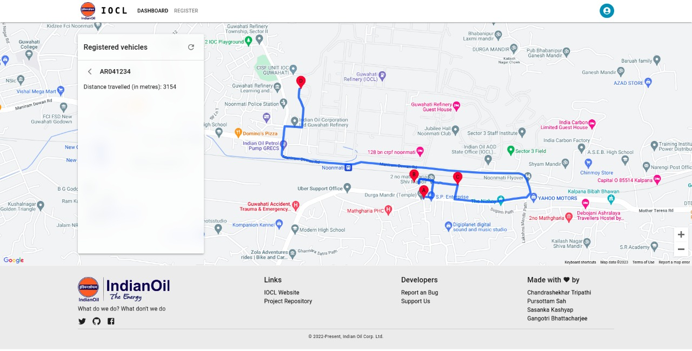

<p align="center">
  
</p>

<div align="center">
<p>GUWAHATI REFINERY</p>
<p>Guwahati, Assam</p>

<p>
WINTER INTERNSHIP PROJECT ON
</p>

## “IOCL VEHICLE MANAGEMENT SYSTEM”

</div>

### DEVELOPED BY
#### Pursottam Sah & Chandrashekhar Tripathi 
<p> 
B. Tech. in Computer Science and Eng.
<br>
National Institute of Technology, Arunachal Pradesh</p>

### UNDER THE GUIDANCE OF

#### Mr. Sumiron Changkakoti
<p> 
Senior Manager, Information System 
<br>
Indian Oil Corporation Limited, Guwahati </p>


## Project Overview 
<p>
We developed an application, IOCL VEHICLE MANAGEMENT SYSTEM, that allows the administrator to register contract-based vehicles under IOCL and generate credentials for the driver so that they can later log in from the driver app we developed. The transport officer can then track the vehicles and calculate the distance the vehicles have travelled. This distance can be used to calculate the vehicle's billing since billing is based on the distance travelled.
</p>


## IOCL VSS is a MERN application. It has three main components

## 1. Admin Portal
```
Here the admin has the full permission to register a new vehicle into the IOCL tracking system and can track the location of all the registered vehicles 
```

## 2 Driver App
```
The driver just need  to install the app  and get credentials provided by the Admin.
```
## 3. Backend 
```
The backend server is implemented using Node Js ,Express and MongoDB
```

## How to Clone this Repository 

Step 1: Clone this repository 
```
git clone "https://github.com/tripathics/iocl-tracker"
```

Step 2: Nevigate to the directory
```
cd iocl-tracker
```


Step 3: Nevigate to client directory
```
cd client
``` 
Step 4: Install the packages and dependencies for client
```
npm i
```

Step 5: Start the application
```
npm start
```

## It will look like that 


Step 6: Setup the Express Server 
```
cd ..
cd server
```
Step 7: Install the Dependencies and Packages
```
npm i
```
Step 8: Start the Express server
```
node server.js
```
### It will look like 
<br>


Step 9: Click on the login page
> For new users sign up yourself then login yourself



#### then it will redirect to login 


Step 10: Now you need to create a Google Map API Key
[Link](https://www.gmapswidget.com/documentation/generate-google-maps-api-key/)
```
Click on the link to follow the steps to create 
```
Step 11: Add your API Key 


### Since there is no vehicels added so it will show empty 

Note : This was Admin Application to install the client application 

Step 13: Register a New Vehicle 
```
Click on the Register button and Add Vehicle Details
```



It will Look like that 


Step 13 : Go to  [Link](https://github.com/Pursottam6003/iocl-tracker-client) and install the app by reading the README file


Step 14: After Sucessfully adding that details inside the driver app you will be able to see the route of the vehicles those who are connected by IOCL Vehicle Management System 




## If you click on the number plate It will show routes




#### Please Give a star if you love to read 


